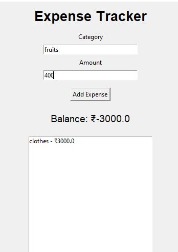
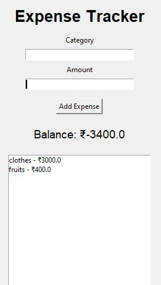

# Expense Tracker App
A simple Expense Tracker application built using Python and Tkinter.

# Features
- Add Expenses
- View Expense History
- Balance Tracking
- Save Data in CSV File

# Technologies Used
- Python
- Tkinter
- CSV

# Run
python app.py

# Ouputs

